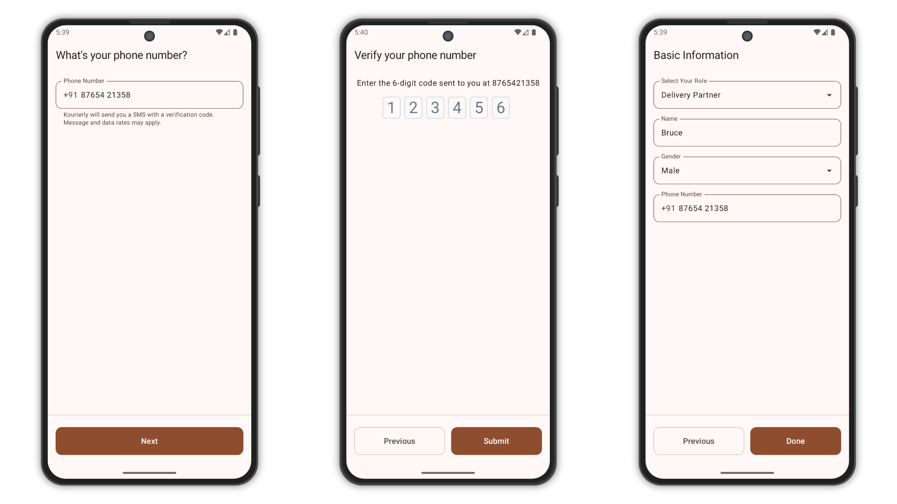

# Kourierly

Kourierly is a lightweight Kotlin-based Android application that demonstrates how to make HTTP
requests using [Ktor Client](https://ktor.io/docs/http-client.html). The app sends customer update
requests (e.g., mobile update) to a remote server and handles JSON serialization/deserialization
using Kotlinx Serialization.

## **Screenshots**

<picture>
  <source media="(prefers-color-scheme: dark)" srcset="screenshots/screenshot-dark.png">
  <source media="(prefers-color-scheme: light)" srcset="screenshots/screenshot.png">
  
</picture>

## Contact

For questions, support, or contributions, reach out
at [mubashirpa2002@gmail.com](mailto:mubashirpa2002@gmail.com)